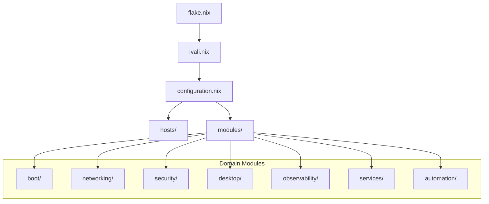
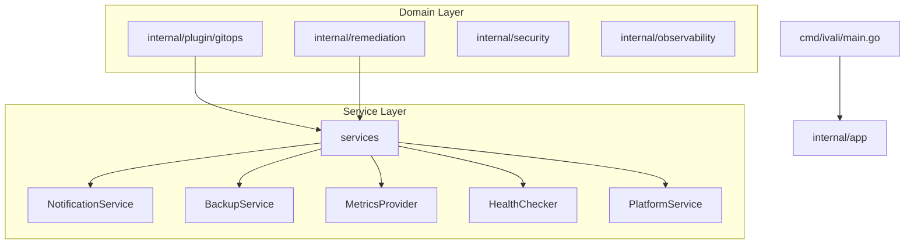

# Architecture

> Complete architectural reference for the ivali NixOS infrastructure.
> This document defines domains, service contracts, dependency graphs,
> and the migration guide for moving from the current implementation
> to the clean architecture.

---

## Table of Contents

1. [Domain Overview](#domain-overview)
2. [Service Contracts](#service-contracts)
3. [Dependency Graphs](#dependency-graphs)
4. [State Ownership](#state-ownership)
5. [Filesystem Ownership](#filesystem-ownership)
6. [Migration Guide](#migration-guide)

---

## Domain Overview

The repository is organized into domain-oriented modules. Each domain has
clear boundaries, owns its state, and communicates through explicit interfaces.

### Domain Hierarchy

```
┌─────────────────────────────────────────────────────────────┐
│                        HOST                                 │
│                    (prague, tuscany)                         │
└─────────────────────────────────────────────────────────────┘
                            │
                    COMPOSITION ONLY
                            │
┌───────────────────┬───────┴───────┬─────────────────────────┐
│                   │               │                         │
▼                   ▼               ▼                         ▼
BOOT            NETWORKING       SECURITY                  DESKTOP
(boot/)         (networking/)    (security/)              (desktop/)
│                   │               │                         │
▼                   ▼               ▼                         ▼
INTERNAL           INTERNAL        INTERNAL                  INTERNAL
```

### Runtime Services

```
┌─────────────────┐
│     GITOPS      │
└─────────────────┘
        │
        │ API
        ▼
┌─────────────┐
│   BACKUP    │
└─────────────┘
        │
        │ API
        ▼
┌─────────────┐
│OBSERVABILITY│
└─────────────┘
```

---

## Service Contracts

All runtime services communicate through explicit interfaces defined in
`internal/services/`. These contracts eliminate cross-domain coupling.

### NotificationService

**Purpose:** Centralized notification delivery across all domains.

**Replaces:**
- `scripts/notify.sh` (used by GitOps, Observability lite)
- Inline notification logic in various scripts

**Interface:**

```go
type NotificationService interface {
    SendAlert(ctx context.Context, severity Severity, title, message string) error
    SendDeploymentResult(ctx context.Context, result DeploymentResult) error
    SendHealthAlert(ctx context.Context, component string, healthy bool, details string) error
}
```

**Implementation:** `internal/services/notification.go`

**Consumers:**
- GitOps: deployment status notifications
- Observability: alert notifications
- Backup: backup completion notifications
- Platform: health check failure notifications

---

### BackupService

**Purpose:** Backup operations for restic-based system backups.

**Replaces:**
- Methods on `GitOpsService` (TriggerBackup, BackupStatus, etc.)
- Direct systemctl/restic CLI calls

**Interface:**

```go
type BackupService interface {
    Trigger(ctx context.Context) error
    Status(ctx context.Context) (*BackupStatus, error)
    ListSnapshots(ctx context.Context, limit int) ([]Snapshot, error)
    LastSnapshot(ctx context.Context) (*Snapshot, error)
    LastRun(ctx context.Context) (time.Time, error)
}
```

**Implementation:** `internal/services/backup.go`

**Consumers:**
- Platform: health checks
- GitOps: post-deploy verification

---

### MetricsProvider

**Purpose:** Query observability backends (Prometheus, Grafana, Loki).

**Replaces:**
- `curl http://127.0.0.1:9090/api/v1/query` in MonitoringService
- Hardcoded Prometheus/Grafana/Loki URLs in Go code
- Direct HTTP calls in dashboard.go

**Interface:**

```go
type MetricsProvider interface {
    Query(ctx context.Context, promQL string) (float64, error)
    ServiceStatuses(ctx context.Context) (map[string]ServiceHealth, error)
    SystemMetrics(ctx context.Context) (*SystemMetrics, error)
}
```

**Implementation:** `internal/services/metrics.go`

**Consumers:**
- Dashboard: service health display
- Platform: health checks

---

### HealthChecker

**Purpose:** Unified system health checks.

**Replaces:**
- `scripts/deployment-health.sh` (357 lines of bash)
- `observability/health-endpoint.nix` (socat + shell script)
- `internal/platform/health/health.go` (Go functions)

**Interface:**

```go
type HealthChecker interface {
    CheckSystem(ctx context.Context) (*SystemHealth, error)
    CheckServices(ctx context.Context, services []string) (map[string]ServiceHealth, error)
    CheckNetwork(ctx context.Context) (*NetworkHealth, error)
    CheckDisk(ctx context.Context, mounts []string) (map[string]DiskHealth, error)
}
```

**Implementation:** `internal/services/health.go`

**Consumers:**
- GitOps: post-deploy health validation
- Platform: `ivali health --system`
- Observability: health endpoint

---

### PlatformService

**Purpose:** Platform-level operations (rebuild, rollback, diagnostics).

**Replaces:**
- Shelling out to `ivali` CLI
- Direct systemctl/nixos-rebuild calls in remediation

**Interface:**

```go
type PlatformService interface {
    Health(ctx context.Context) (*PlatformHealth, error)
    Status(ctx context.Context) (*PlatformStatus, error)
    Doctor(ctx context.Context) (*DiagnosticReport, error)
    Rebuild(ctx context.Context, host string) (string, error)
    Rollback(ctx context.Context) (string, error)
}
```

**Implementation:** `internal/services/platform.go`

**Consumers:**
- GitOps: deployment operations
- Remediation: system fixes

---

## Dependency Graphs

### Nix Module Dependencies



### Go Package Dependencies



---

## State Ownership

Each domain owns its state. Cross-domain state access is prohibited
unless explicitly documented as an exception.

| Domain | State Path | Owner | Consumers |
|--------|-----------|-------|-----------|
| GitOps | `/var/lib/gitops/` | GitOps | Deployment Health |
| Observability | `/var/lib/observability/` | Observability | Platform (via interface) |
| Backup | `/mnt/backup/` | Backup | Platform (via interface) |
| Security | None (stateless) | Security | Platform (via interface) |

---

## Filesystem Ownership

Each domain owns specific filesystem paths. Other domains must not
directly read/write these paths without going through an interface.

| Path | Owner | Purpose | Cross-Domain Access |
|------|-------|---------|-------------------|
| `/run/secrets/*` | SOPS | Secret material | Allowed (all domains read) |
| `/var/lib/gitops/*` | GitOps | Repository state | Forbidden |
| `/var/lib/observability/*` | Observability | Metrics state | Forbidden |
| `/var/lib/health-endpoint/*` | Observability | Health cache | Forbidden |
| `/mnt/backup/*` | Backup | Restic repository | Forbidden |
| `/run/deploy.lock` | GitOps | Deployment mutex | Allowed (CI reads) |

---

## Migration Guide

### Phase 1: Adopt Service Contracts

**Goal:** Replace direct cross-domain calls with service interface calls.

**Step 1.1: Implement concrete service types**

Create concrete implementations of the interfaces in `internal/services/`:

```go
// internal/services/notification/notification.go
type NotificationService struct {
    // Implementation details
}

func (n *NotificationService) SendAlert(ctx context.Context, severity services.Severity, title, message string) error {
    // Implementation using notification service
}
```

**Step 1.2: Wire up service registry**

In `cmd/ivali/main.go`:

```go
registry := services.NewRegistry(
    notification.NewNotificationService(),
    backup.NewResticBackup(),
    metrics.NewPrometheusMetrics(),
    health.NewSystemHealth(),
    platform.NewNixOSPlatform(),
)
```

**Step 1.3: Refactor consumers**

Replace direct calls with interface calls:

```go
// Before
output := c.svc.Nix.Rebuild("")

// After
output, err := c.registry.Platform.Rebuild(ctx, host)
```

### Phase 2: Eliminate notify.sh

**Goal:** Replace `scripts/notify.sh` with the NotificationService interface.

**Step 2.1:** Implement `NotificationService` concrete type

**Step 2.2:** Update `observability/lite.nix` to call `ivali notify` instead of `notify.sh`

**Step 2.3:** Update notification consumers to use the same interface

**Step 2.4:** Remove `scripts/notify.sh` after all consumers are migrated

### Phase 3: Unify Health Checks

**Goal:** Replace three health check implementations with HealthChecker interface.

**Step 3.1:** Implement `SystemHealth` concrete type

**Step 3.2:** Update `scripts/deployment-health.sh` to call `ivali health --system`

**Step 3.3:** Update `observability/health-endpoint.nix` to call `ivali health --system`

**Step 3.4:** Remove duplicate health check logic from scripts and Nix modules

### Phase 4: Extract Backup from GitOps

**Goal:** Move backup methods from GitOpsService to BackupService.

**Step 4.1:** Implement `ResticBackup` concrete type

**Step 4.2:** Update handlers to use BackupService

**Step 4.3:** Remove backup methods from GitOpsService

### Phase 5: Eliminate Hardcoded Ports

**Goal:** Replace hardcoded observability ports with MetricsProvider.

**Step 5.1:** Implement `PrometheusMetrics` concrete type

**Step 5.2:** Update MonitoringService to use MetricsProvider

**Step 5.3:** Update dashboard.go to use MetricsProvider

**Step 5.4:** Remove hardcoded port numbers from Go code

---

## Verification

After each migration phase, verify:

1. `go build ./...` — all packages compile
2. `go test ./...` — all tests pass
3. `golangci-lint run` — no lint errors
4. `nix flake check --no-build` — NixOS configurations evaluate
5. Manual testing — verify end-to-end functionality

---

## Exceptions

Documented exceptions to the clean architecture rules are in
`architecture/exceptions.yaml`. Each exception must specify:
- Source and target domains
- Reason for the exception
- Owner responsible for maintaining it
- Review date for re-evaluation
