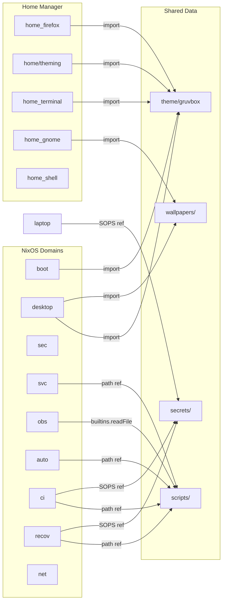
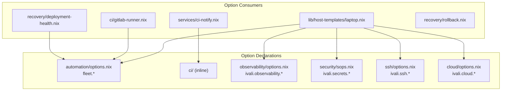
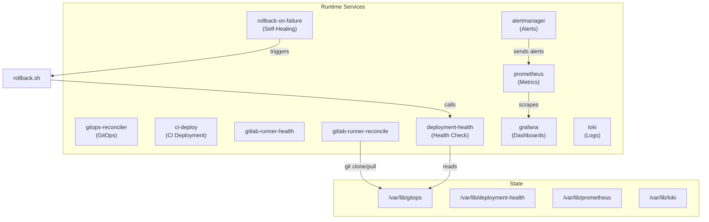

# Architecture Audit

> Generated from a complete audit of the nixos-infrastructure repository.
> Branch: `main` — 187 Nix files, 127 Go files, 16 shell scripts, ~40 systemd services.

---

## 1. Current Architecture

### 1.1 Module System

The repository uses a **domain-oriented auto-discovery architecture**:

```
flake.nix
  ├── configuration.nix          ← auto-discovers domain modules
  │     ├── lib/auto-imports.nix ← scans directories for *.nix
  │     ├── desktop/             ← explicit import
  │     ├── packages/system      ← explicit import
  │     ├── boot/                ← auto-discovered
  │     ├── networking/          ← auto-discovered
  │     ├── security/            ← auto-discovered
  │     ├── services/            ← auto-discovered (with subdirs)
  │     ├── observability/       ← auto-discovered
  │     ├── automation/          ← auto-discovered
  │     ├── ci/                  ← auto-discovered
  │     ├── recovery/            ← auto-discovered
  │     ├── developer/           ← auto-discovered
  │     ├── ssh/                 ← auto-discovered
  │     ├── storage/             ← auto-discovered
  │     ├── system/              ← auto-discovered
  │     ├── i18n/                ← auto-discovered
  │     ├── cloud/               ← auto-discovered
  │     ├── caching/             ← auto-discovered
  │     ├── cache/               ← auto-discovered
  │     └── virtualization/      ← auto-discovered
  ├── hosts/hosts.nix            ← auto-discovers host specs
  │     ├── prague.nix
  │     ├── tuscany.nix
  │     └── testvm.nix
  ├── lib/host-templates/laptop.nix ← generates config from hostSpec
  └── home/ivali.nix             ← Home Manager composition
        └── home/default.nix     ← imports shell, git, gnome, firefox, editors, env
```

### 1.2 Host Composition

Hosts are pure data (attrsets). The laptop template generates all NixOS configuration:

```nix
# hosts/prague.nix — host spec (data only)
{
  hostName = "prague";
  userName = "ivali";
  features = { secrets = true; gitlabRunner = true; ... };
  config = {
    ivali.desktop.gnome.enable = true;
    fleet.gitopsReconciler.enable = true;
    fleet.deploymentHealth.enable = true;
    ...
  };
}
```

### 1.3 Domain Inventory

| Domain | Path | Files | State Paths | Timers |
|--------|------|-------|-------------|--------|
| **boot** | `boot/` | 7 | — | — |
| **desktop** | `desktop/` | 11 | — | — |
| **home** | `home/` | 40+ | — | — |
| **networking** | `networking/` | 3 | — | — |
| **security** | `security/` | 11 | /var/lib/security-scanner, /var/lib/tailscale-metrics | security-scan |
| **services** | `services/` | 12 | — | — |
| **observability** | `observability/` | 17 | /var/lib/prometheus, /var/lib/loki, /var/lib/grafana, /var/lib/observability, /var/lib/health-endpoint | nixos-exporter-cache, observability-lite |
| **automation** | `automation/` | 5 | — | gitops-reconciler, channel-bump |
| **ci** | `ci/` | 3 | /var/lib/gitlab-runner-health | gitlab-runner-health, gitlab-runner-reconcile |
| **recovery** | `recovery/` | 4 | /var/lib/deployment-health | deployment-health, restic-backup |
| **ssh** | `ssh/` | 4 | — | — |
| **storage** | `storage/` | 3 | — | — |
| **system** | `system/` | 4 | — | — |
| **developer** | `developer/` | 14 | — | — |
| **i18n** | `i18n/` | 2 | — | — |
| **cloud** | `cloud/` | 2 | — | — |
| **caching** | `caching/` | 1 | — | — |
| **cache** | `cache/` | 1 | /var/lib/attic | — |
| **virtualization** | `virtualization/` | 2 | — | — |
| **theme** | `theme/gruvbox/` | 9 | — | — |

---

## 2. Dependency Graphs

### 2.1 Nix Import Graph

```mermaid
graph TD
    flake["flake.nix"] --> config["configuration.nix"]
    flake --> hosts["hosts/hosts.nix"]
    flake --> laptop["lib/host-templates/laptop.nix"]
    flake --> hm["home/ivali.nix"]

    config --> desktop["desktop/"]
    config --> pkgs_sys["packages/system"]
    config --> boot["boot/"]
    config --> net["networking/"]
    config --> sec["security/"]
    config --> svc["services/"]
    config --> obs["observability/"]
    config --> auto["automation/"]
    config --> ci["ci/"]
    config --> recov["recovery/"]
    config --> dev["developer/"]
    config --> ssh["ssh/"]
    config --> stor["storage/"]
    config --> sys["system/"]
    config --> i18n["i18n/"]
    config --> cloud["cloud/"]
    config --> cach["caching/"]
    config --> cache["cache/"]
    config --> virt["virtualization/"]

    laptop --> sec
    laptop --> auto
    laptop --> ci
    laptop --> obs
    laptop --> svc
    laptop --> ssh

    hm --> home_shell["home/shell"]
    hm --> home_git["home/git"]
    hm --> home_gnome["home/gnome"]
    hm --> home_firefox["home/firefox"]
    hm --> home_editors["home/editors"]
    hm --> home_env["home/environment"]
    hm --> home_terminal["home/terminal"]
```



### 2.2 Cross-Domain Import Dependencies



### 2.3 Option Namespace Dependencies



### 2.4 Runtime Service Graph



---

## 3. Violation Findings

### 3.1 Circular Dependencies

**Result: NONE FOUND.** The Nix import graph is acyclic. The auto-discovery system creates a clean tree structure with no circular imports.

### 3.2 Cross-Domain Coupling

| # | Source | Target | Type | Severity |
|---|--------|--------|------|----------|
| C1 | `services/ci-notify.nix` | `config.fleet.gitlabRunner.enable` | option read (ci domain) | Medium |
| C2 | `recovery/deployment-health.nix` | `config.fleet.gitops` | option read (automation domain) | Medium |
| C3 | `ci/gitlab-runner.nix` | `config.fleet.gitops` | option read (automation domain) | Medium |

### 3.3 Cross-Domain Filesystem Access

| # | Consumer | Path | Owner | Access | Verdict |
|---|----------|------|-------|--------|---------|
| F1 | `ci/gitlab-runner.nix` | `/var/lib/gitops` | automation (implicit) | R/W (creates, clones) | **VIOLATION** |
| F2 | `recovery/deployment-health.nix` | `/var/lib/gitops` | automation (implicit) | R (reads) | **QUESTIONABLE** |
| F3 | `recovery/deployment-health.sh` | `/var/lib/gitops` | automation (implicit) | R | **QUESTIONABLE** |
| F4 | `ci/gitlab-runner-health.sh` | `/var/lib/gitops` | automation (implicit) | R | **QUESTIONABLE** |
| F5 | `observability/lite.nix` | `notify.sh` (builtins.readFile) | scripts/ | compile-time copy | **QUESTIONABLE** |
| F6 | `internal/commands/status.go` | `/var/lib/observability/state.json` | observability | R | **QUESTIONABLE** |

### 3.4 Duplicate Configuration

| # | Issue | Files | Severity |
|---|-------|-------|----------|
| D1 | `systemd.services.loki` CPUQuota: 15% vs 10% | `observability/loki.nix:89` vs `observability/grafana.nix:121` | **HIGH** — conflicting values |
| D2 | `systemd.services.prometheus` CPUQuota/CPUWeight duplicated | `observability/prometheus.nix:111` vs `observability/grafana.nix:130` | Medium — identical values, fragile |
| D3 | `systemd.services.prometheus-node-exporter` CPUQuota/CPUWeight duplicated | `observability/prometheus.nix:119` vs `observability/grafana.nix:135` | Medium — identical values, fragile |
| D4 | Firewall tailscale0 port 22 split ownership | `security/firewall.nix:127` vs `ssh/daemon.nix:50` | Medium — redundant rule |
| D5 | `nix.settings.substituters` 3-way split | `system/nix.nix`, `caching/default.nix`, `cache/default.nix` | Low — fragile merge order |
| D6 | `nixpkgs.config.allowUnfree` duplicated | `system/nix.nix:23` vs `developer/antigravity.nix:35` | Low — redundant |
| D7 | 16 package declarations duplicated across `packages/cli/` and domain modules | Multiple files | Low — NixOS deduplicates, but ownership unclear |

### 3.5 Undeclared Dependencies

| # | Script/Module | Undeclared Dependency | Severity |
|---|---------------|----------------------|----------|
| U1 | `scripts/gitops-reconcile.sh` | `ivali` CLI binary | Medium |
| U2 | `scripts/rollback.sh` | `ivali` CLI binary | Medium |
| U3 | `scripts/deployment-health.sh` | `sshd.service`, `nginx.service`, `tailscaled.service` | Medium |
| U4 | `scripts/notify.sh` | `sendmail` (msmtp) | Low |
| U5 | `scripts/gitlab-runner-reconcile.sh` | `flock`, `gitlab-runner` | Low |
| U6 | `services/ci-notify.nix` | `/tmp/ci-notify.env` (written externally) | Medium |

### 3.6 Internal API Violations

**Result: NONE FOUND.** No domain has `internal/` directories. All modules are flat within their domain directories. This is a future concern — when domains grow, internal boundaries will be needed.

### 3.7 Cross-Service State Mutation

| # | Mutator | State Path | Owner | Verdict |
|---|---------|-----------|-------|---------|
| S1 | `gitlab-runner-reconcile.service` (ci) | `/var/lib/gitops` | automation (implicit) | **VIOLATION** — CI creates/manages automation state |

### 3.8 Hardcoded Hostname Violations

| # | File | Hardcoded Value | Should Use |
|---|------|----------------|------------|
| H1 | `scripts/gitops-reconcile.sh:26` | `HOST="prague"` | `$HOST_NAME` env var |
| H2 | `scripts/rollback.sh:14` | `HOST="prague"` | `$HOST_NAME` env var |
| H3 | `scripts/gitlab-runner-reconcile.sh:27` | `HOST="prague"` | `$HOST_NAME` env var |
| H4 | `scripts/ci-deploy.sh:9` | `HOST="${HOST_NAME:-prague}"` | Should fail if unset |
| H5 | `scripts/gitlab-runner-reconcile.sh:101` | `--tag-list "nixos,prague,self-hosted"` | Dynamic tag |

---

## 4. State Ownership Table

| State Path | Owner | StateDirectory? | Consumers | Mutation Authority |
|------------|-------|-----------------|-----------|-------------------|
| `/var/lib/valkey` | services/redis | Yes | — | redis only |
| `/var/lib/security-scanner` | security | Yes | Prometheus (scrape) | security only |
| `/var/lib/deployment-health` | recovery | Yes | — | recovery only |
| `/var/lib/observability` | observability | Yes | ivali CLI (reads state.json) | observability only |
| `/var/lib/health-endpoint` | observability | Yes | — | observability only |
| `/var/lib/prometheus` | observability | Yes | — | observability only |
| `/var/lib/loki` | observability | Yes | — | observability only |
| `/var/lib/attic` | cache | Yes | — | cache only |
| `/var/lib/gitlab-runner-health` | ci | Yes | — | ci only |
| `/var/lib/tailscale-metrics` | security | **NO** (mkdir -p) | Prometheus (scrape) | security only |
| `/var/lib/gitops` | **UNOWNED** | **NO** | ci (R/W), recovery (R) | **NO FORMAL OWNER** |

---

## 5. Proposed Domain Architecture

### 5.1 Domain Hierarchy

```
LEVEL 0 — Core (no external dependencies)
  system/     — Nix daemon, users, state version
  i18n/       — Locale
  storage/    — BTRFS, tmpfs
  boot/       — Kernel, loader, sysctl, zram, tpm, plymouth, resilience

LEVEL 1 — Platform (depends on Core)
  networking/ — NetworkManager, DNS, timezone
  security/   — Firewall, AppArmor, fail2ban, hardening, scanning, sops, sudo, tailscale
  ssh/        — SSH daemon, client
  theme/      — Gruvbox theme (pure data)
  packages/   — CLI, desktop, system, user package sets

LEVEL 2 — Functional Domains (depends on Platform)
  desktop/    — GNOME, GDM, audio, GPU, fonts, portals
  home/       — User config (shell, git, gnome, firefox, editors, env)
  developer/  — Go, Node, Python, Kotlin, DevOps, databases
  cloud/      — Google Cloud SDK, GKE
  virtualization/ — Docker

LEVEL 3 — Runtime Services (depends on Platform + Functional)
  services/   — nginx, postgres, redis, msmtp
  observability/ — Prometheus, Grafana, Loki, Alloy, Falco, OTEL, alerting
  automation/ — GitOps reconciler, channel bump
  ci/         — GitLab runner, CI deploy
  recovery/   — Deployment health, rollback, backup
  cache/      — Attic binary cache
  caching/    — Go binary cache

LEVEL 4 — Host Composition
  hosts/      — prague, tuscany, testvm (pure data)
  lib/host-templates/ — generates config from hostSpec
```

### 5.2 Dependency Direction Rules

| From → To | Allowed? | Notes |
|-----------|----------|-------|
| Level 0 → anything | No | Core must not depend on higher levels |
| Level 1 → Level 0 | Yes | Platform depends on Core |
| Level 2 → Level 0-1 | Yes | Functional depends on Core + Platform |
| Level 3 → Level 0-2 | Yes | Services depends on all below |
| Level 4 → Level 0-3 | Yes | Host composition enables anything |
| Level N → Level N+1 | **No** | Never depend upward |
| Domain A → Domain B (same level) | **Only via public API** | No internal path access |

### 5.3 `/var/lib/gitops` Ownership Resolution

**Current state:** No formal owner. CI creates it, recovery reads it.

**Proposed:** `automation/` owns `/var/lib/gitops` via `StateDirectory = "gitops"` on `gitops-reconciler.service`. CI and recovery become read-only consumers through a documented interface.

---

## 6. Dead Code Assessment

No dead code was identified during this audit. All modules are actively imported and used. The repository is well-maintained with no abandoned automation or obsolete remnants.

---

## 7. Migration Plan

### Phase 1: Establish Boundaries (Immediate)
- [ ] Add `StateDirectory = "gitops"` to `automation/gitops-reconciler.nix`
- [ ] Fix conflicting `loki` CPUQuota (consolidate into `observability/grafana.nix`)
- [ ] Remove duplicate `prometheus`/`prometheus-node-exporter` resource limits from `grafana.nix`
- [ ] Fix hardcoded `HOST="prague"` in all 5 shell scripts → use `$HOST_NAME`
- [ ] Fix hardcoded `prague` in Go code → read from config/context

### Phase 2: Establish Ownership (Short-term)
- [ ] Create `architecture/` directory with domains.yaml, dependencies.yaml, exceptions.yaml
- [ ] Document all cross-domain dependencies as explicit exceptions or refactor to remove
- [ ] Add `StateDirectory = "tailscale-metrics"` to tailscale-metrics service
- [ ] Consolidate firewall tailscale0 port 22 ownership into `ssh/daemon.nix`

### Phase 3: Add Public Interfaces (Medium-term)
- [ ] Define a `notify` interface (e.g., a script/service that other domains can call)
- [ ] Document `observability/state.json` read as an explicit exception
- [ ] Extract `fleet.*` option declarations into a shared `options/fleet.nix`

### Phase 4: Build Architecture Linter (Medium-term)
- [ ] Implement Go-based architecture checker in `internal/architecture/`
- [ ] Add 7 validation checks (forbidden imports, circular deps, filesystem access, etc.)
- [ ] Create `ci/check-architecture` command
- [ ] Integrate into GitHub Actions CI pipeline

### Phase 5: Enable CI Enforcement (Long-term)
- [ ] Architecture validation runs before expensive Nix builds
- [ ] PRs that introduce forbidden cross-domain dependencies are blocked
- [ ] Regular architecture health reports
